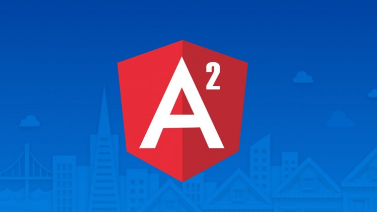

# Anglular 2 

  

## CONTENTS

1. [OVERVIEW](#)
2. [SETTING UP BASE COMPONENTS](#SETTING-UP-BASE-COMPONENTS)
3. [Understanding Packages](#PACKAGE)
3. [Test ](#Test-Server)
4. [Making your first change](#Making-your-first-change)
5. [BREAKDOWN OF ANGULAR FILE STRUCTURE](BREAKDOWN-OF-ANGULAR-FILE-STRUCTURE)
6. [WHAT ARE ANGULAR COMPONENTS?](#COMPONENTS)

## OVERVIEW  

Angular 2 is an open source JavaScript framework to build web applications in HTML and JavaScript. This tutorial looks at the various aspects of Angular 2 framework which includes the basics of the framework, the setup of Angular and how to work with the various aspects of the framework. Other topics discussed in the tutorial are advanced chapters such as interfaces, nested components and services within Angular. Topics such as routing, modules, and arrays are also dealt with in this tutorial.

# SETTING UP BASE COMPONENTS

## Resources to clone 

There are a lot of resources required to download even for a base project, I have used bare minimum from BuckyRoberts example which can be found [here](https://github.com/buckyroberts/angular-2-template) .
 
What to do is, take that link, and in the directory you want to work in just run 

`git clone https://github.com/buckyroberts/angular-2-template` 
 
This will give you all the pieces you need to get started, the base files and a simple bit of Angular displying a html heading.

## Installing NPM and Node.js

Download the latest version of Node.js if you do not already have it installed on your machine. This download will also include the latest version of npm.

[Download Link](https://nodejs.org/en/download/)

## Run the Project

You can kick off the base project from Bucky's repo simply by running the command below. The program is executed with a TypeScript compiler in watch mode and run lite-server with automatic refreshing.

`npm install`

then 

`npm start`


## PACKAGE 

Each package.json is a list of dependencies like below - we don't have these downloaded yet, this is why we have Node.js which comes with npm that does it automatically.

```
{
  "name": "angular-2",
  "version": "1.0.0",
  "scripts": {
    "start": "concurrently \"npm run tsc:w\" \"npm run lite\" ",
    "tsc": "tsc",
    "tsc:w": "tsc -w",
    "lite": "lite-server",
    "typings": "typings",
    "postinstall": "typings install"
  },
  "license": "ISC",
  "dependencies": {
    "angular2": "2.0.0-beta.13",
    "systemjs": "0.19.25",
    "es6-shim": "^0.35.0",
    "reflect-metadata": "0.1.2",
    "rxjs": "5.0.0-beta.2",
    "zone.js": "0.6.6"
  },
  "devDependencies": {
    "concurrently": "^2.0.0",
    "lite-server": "^2.1.0",
    "typescript": "^1.8.9",
    "typings":"^0.7.11"
  }
}

```


If you haven't already - you should run 'npm install' to download dependencies. 


## Test Server 

Note the test server in the package `npm run lite\` instead of having to refresh browser each time, code changes are updated automatically.


# Making your first change 

Once you start the server with `npm start` assuming you already ran `npm install` you should see the browser load up with the text `Angular 2 Template` we can amend this in the following location

`app/ts/app.component.ts`

# BREAKDOWN OF ANGULAR FILE STRUCTURE 
 
<p align="center">

</p>

## APP

This is our main directory inside we have ts for typescript and js for javascript. 95% of time we are going to be working in ts folder. 

<p align="center">

</p>

**NOTE** don't mess with the js files they are generated automatically 


# TypeScript 

**Note** Type script will need to be translated into javascript for browser (you can translate online using transpilers) but in our case we can add script tags in the html like   

`script src="node_modules/angular2/bundles/angular2.dev.js"></script>`  


 It gets translated into javascript automatically and dumped in a js folder. Remember its the js files the browser actually uses. 

## Map files 

These are extra files that help you debug your code - because it maps the error in js to where it actually is in your ts


## NODE MODULES 

**DONT** mess with node modules, these are imported when you run `npm install` from specified dependencies in package.json

## TYPINGS

Whenever we use new libraries javascript doesn't understand some of the syntax we use by default, so we use these typings files to provide the new rules which lets our transpiler do the conversion.  Also **DONT** touch.

## tsconfig.json 

These are details about how we wan't to convert typescript to javascript such as below : 

```

{
  "compilerOptions": {
    "target": "es5",
    "module": "system",
    "moduleResolution": "node",
    "outDir": "app/js",
    "sourceMap": true,
    "emitDecoratorMetadata": true,
    "experimentalDecorators": true,
    "removeComments": false,
    "noImplicitAny": false
  },
  "exclude": [
    "node_modules",
    "typings/main",
    "typings/main.d.ts"
  ]
}

```

**outDir** - where to dump JS files 

## index.html 

Your main page, home page 


# COMPONENTS