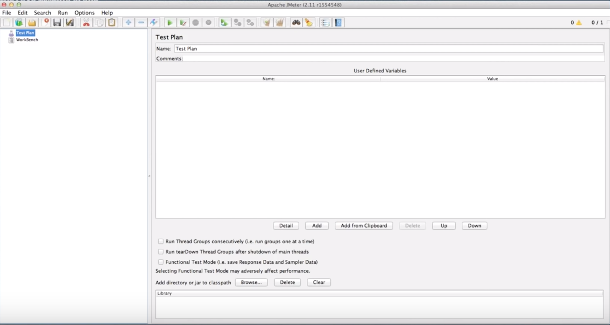
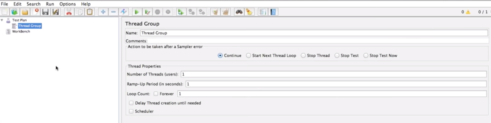

# JMETER 

 

1. [What is performance Testing?](#WHAT-IS-PERFORMANCE-TESTING)
2. [JMETER interface](#JMETER-INTERFACE)
3. [Creating a Simple Static Script](#STATIC-SCRIPT)
4. [Recording actual browser activity](#)
5. [User Login & Authentication](#)
6. [Dynamic Requests & User Variables](#)
7. [Extracting Values with Regular Experessions](#)
8. [CSV files](#)


# WHAT IS PERFORMANCE TESTING

Ensure user experience is fast and error free under any load.

## How?

1. Create user load 
2. Measure the user experience 

**HOW** does JMETER work? First we should understand how the browser works - it sends request to URL server responds with resources such as an image. Then the browser parses the response.  

Finally the browser executes javascript js and repeats. **JMETER** is an open source apache tool, and does the following series of steps to achieve the 2 objectives. 

1. JMeter sends a request *(http)*
2. Server responds (with html resource)
3. JMETER pareses response  ~~and executes javascript~~
4. JMeter optionally parses and can simulate anything a browser does 

# JMETER INTERFACE

## JMETER VOCAB & TERMS 

  

The left hand side is where you create all the logic for your script with all the steps, on the right hand side is the details of all the different steps.

- TEST PLAN (JMeter Script)
- THREAD GROUP (thread = user)
- SAMPLERS (makes a request)
- CONFIG ELEMENTS 
- TIMER (add a delay)
- LISTENER (reporting, logging, debugging)
- ASSERTIONS (error checking)
- PRE PROCESSORS (modify request)
- POST PROCESSORS (parse the response)
- LOGIC CONTROLLER (loops, if statements etd)
- WORK BENCH (temp working space)


# STATIC SCRIPT

Now we will create a static script, first lets add a thread group from the menu.   

  

This is essentially a group of users 

 

Not all details will be covered, I will focus on only the main details, set the following:

```
Number of threads = 10
Ramp up period = 60 (seconds)
Loop count = 3 (times)
```


## Adding a Sampler 

Lets add a sampler, which is just a http request as shown below. 

 

Now we will need to fill out the elements for the http request. But first we will show how we are creating a script for a specific scenario. There is a blogging platform called ghost, which can be installed locally. We can see how to log into ghost, store articles in csv format etc.

 


<p align="center">

</p>


WORKING FROM FOLLOWING RESOURCE 
https://www.youtube.com/watch?v=cv7KqxaLZd8