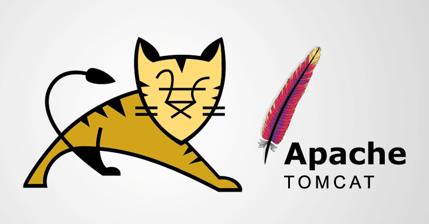
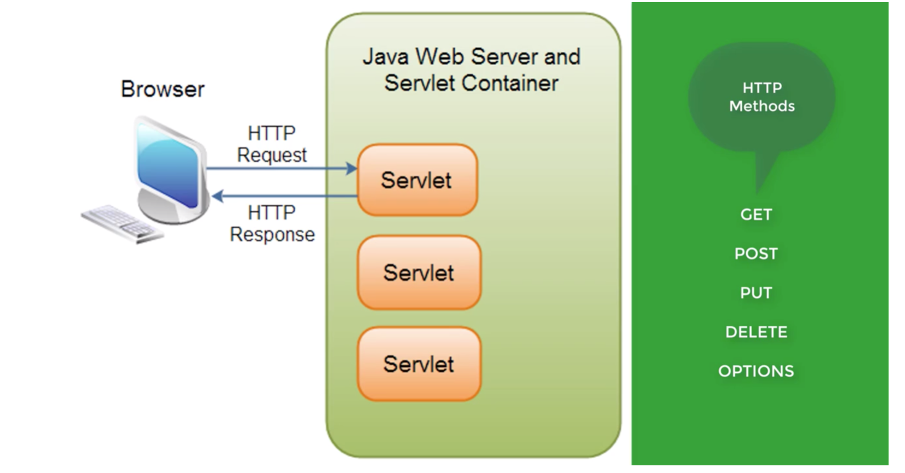
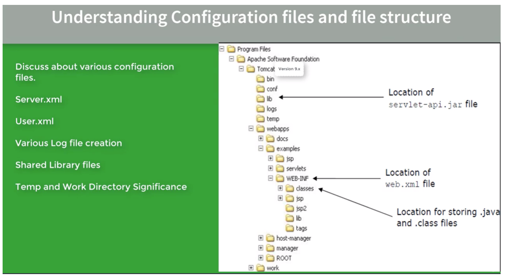

# TOMCAT - OVERVIEW 

  

## TOPICS COVERED 

1. What is rule of Tomcat as Java based web server 
2. Installation (Linux or Windows)
3. Features of Manager applicaiton 
4. Different ways of Deploying Applications
5. TomCat File structure
6. Security features
7. User creation
8. Role Creation
9. Configure SSL key
10. Creating Self Signed SSL Certificates
11. Enabling SSL for Web Applications 
12. Configuring SSL Certificates
13. Realms
14. Valves
15. High Availabiliy Cluster using X nodes and Nginix Load Balancer
16. Session Replication & its management in Cluster
17. Various Strategies of Session management 
18. How to use Tomcat as Virtual hosting Environment create virtual host, make tomcat run as vs server
19. HOST MULTIPLE WEBSITE ON SINGLE RESOURCE
20. Log Generation and Customization 
21. Local Framework used for logging 
22. Tuning and Performance Stuff

# OVERVIEW OF SERVLETT CONTAINER

  

## CORE FEATURE -  HTTP REQ/RESP MODEL

1. A request made for any dynamic web resource like a JSP Servlet 
2. Servlet is a Specialised JAVA CLASS 
2.1 Handles http requests like GET, POST, PUT etc

  
  
3. If the resource called is a JSP - it is translated and compiled into a Servlet before being executed by the container  

## TOMCAT COMPONENTS

For End to End Lifecycle Execution Various Components are Required.

  

## CATALINIA 

- Core container, does init(), Service() , destroy()
- MAIN ROLE - CONTROL LIFECYCLE 
- By Loading, Initializing, Serving and Destroying the Servlet as per Java Specification of JSP and Servlets 
- Manages the whole Bean Lifecycle - it is the core component.

## JASPER 

- JSP Engine
- Converts JSP pages/code to Servlets 
- This happens before servicing the request 
- So if you change JSP mid flight, Jasper can potentially generate the updated servlet in time for the response 

## COYOTE
- Connector component 
- Listens to TCP/IP ports to transmit web requests to container and end users
- Vital in integration with other Web Servers and providing Static Content
- Vital in running the applicaiton on SSL
 
## CLUSTER
- Important whilst running in distributed mode 
- Added to manage large applications 
- Used for load balancing via many techniques 

## Manager Application

 

## FILE SYSTEM 

 

# TOMCAT - SETUP & INSTALL

## Downloading Latest Version of Java   

From the following: 

[JAVA-LINK](https://www.oracle.com/technetwork/java/javase/downloads/index.html)  

## Downloading Latest Version of Tomcat   

1. Google Download Tomcat
2. [tomcat.apache.org](tomcat.apache.org)
3. Look on Left hand side select your version then appropriate binary 

## running on windows 

1. install JDK select the appropriate one 
2. go to apache site , download TOMCAT  9 
3. search for TC9  - select 64 bit or 32 bit etc 
4. no need to install service installer 
5. run JDK8 as administrator - opens wizard etc. 
6. Once complete we need to set up javahome envirionment variable 
7. Unzip TOMCAT 
8. Rename as tomcat9  
9. go to bin folder, invoke startup.bat 
10. doubleclick 
11. if javahome set up correctly it should work 
12. o to browser, then open localhost:8080 to see open page

## Running on Mac

If you don’t have root access you may need to use SUDO 
Download JDK, Tomcat, Set Java Path , make all scritps executable 

1. Download JDK [HERE](http://www.oracle.com/technetwork/java/javase/downloads/jdk8-downloads-2133151.html)
2. select file as per machine architecture
3. Download tomcat9 
4. set java path 
4.1 open terminal 
4.2 nano ~/.bash_profile
4.3 add path.. = java location 
4.4 to find java install location - echo $(/usr/libexec/java_home) 
5. DONT enter source ~/.bash_profile
6. cd tomcat9/bin or in mycalse /Library/Tomcat/bin 
7. Note this [link](https://wolfpaulus.com/mac/tomcat/)
8. go [here](https://www.youtube.com/watch?v=bUkhS3GdVC4 ) 
9. `cd /libary/tomcat/bin`
10. make all sh scripts executable 
11. 
``chmod +x *.sh`
./startup .sh  ** should read Tomcat Started
http://localhost:8090/ to see Tomcat
`` 

# Running on Linux

1. If you don’t have root access you may need to use SUDO
2. Download JDK, Tomcat, Set Java Path , make all scritps executable 
3. Download JDK & Tomcat appropriate Linux Versions
4. Make sure they are both in binaries folder usr/bin or usr/binaries
5. Unpack both downloaded .tar files 
`tar -zxvf mybinarythatidownloaded.tar` (will take time to unpack)
6. set java path/home 
7. open terminal 
8. Check bash profile exists
 `ls -l ~/.bash_profile ` If this does not exist, create by running `touch ~/.bash_profile`
9. `nano ~/.bash_profile` and add the following `export JAVA_HOME=/usr/binaries/nameofjavaversion`
10. enter `source ~/.bash_profile `
11. `cd tomcat9/bin ` or in my case /Library/Tomcat/bin 
12. `./startup .sh  ** should read Tomcat Started `
13. [http://localhost:8080/](http://localhost:8080/) to see Tomcat

## CHANGING TOMCAT PORT 

1. You may already be using port 8080 (in my case for jenkins)
2. Tomcat -> conf -> server.xml
3. Edit server.xml.
4. Search "Connector port"
5. Replace "8080" by your port number.
6. Restart tomcat server.
7. note redirection port is 8443

